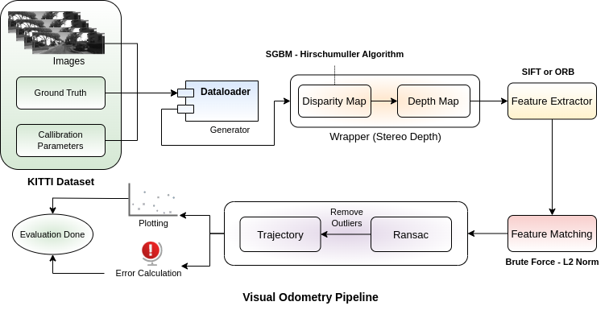
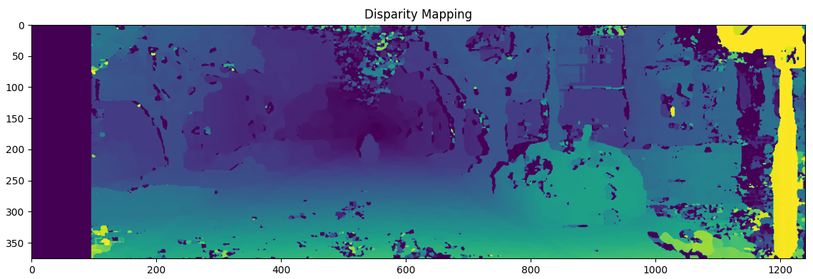
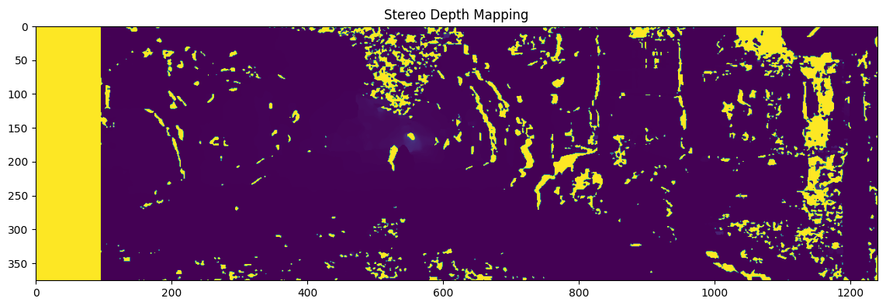
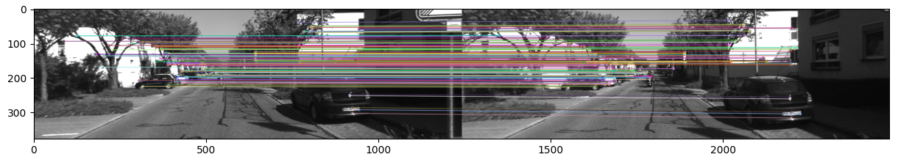
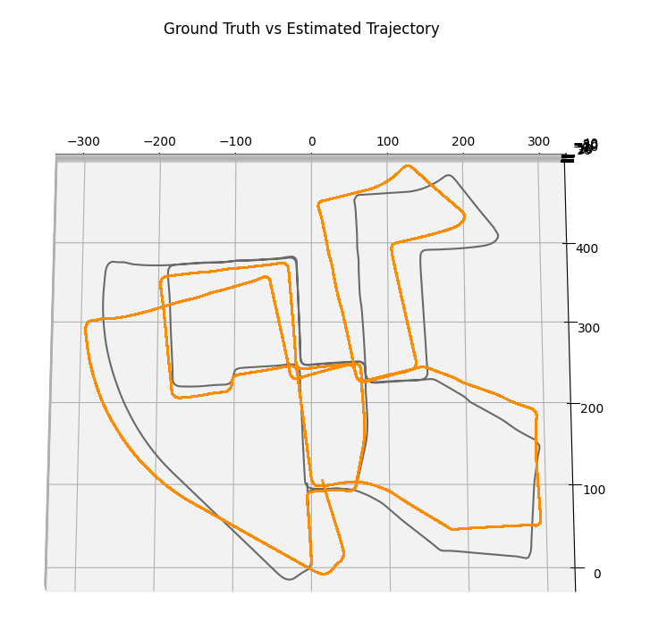

# Visual Odometry with Stereo Vision

This project implements a visual odometry solution using stereo vision. The goal is to compute the trajectory of a moving camera using stereo image pairs and calibration data.

## Visual Odometry Pipeline



## Prerequisites

Before running this script, you need to install the following Python libraries:

- OpenCV
- NumPy
- Matplotlib
- Pandas

## Directory Structure

```
base_path/
├── 00/
    ├── image_0/
    │   ├── 000000.png
    │   ├── 000001.png
    │   └── ...
    ├── image_1/
    │   ├── 000000.png
    │   ├── 000001.png
    │   └── ...
    ├── calib.txt
    └── pose.txt
```

## Running the Script

```
Main.py
```

## The Script Includes Several Functions:

- `disparity_mapping(left_image, right_image)`
  Computes the disparity map between two stereo images.

  

- `decomposition(p)`
  Decomposes a projection matrix into intrinsic matrix, rotation matrices, and translation vector.

- `depth_mapping(left_disparity_map, left_intrinsic, left_translation, right_translation, rectified=True)`
  Computes a depth map from the disparity map.

- `stereo_depth(left_image, right_image, P0, P1)`
  Computes depth using stereo images and projection matrices.

  

- `read_calibration(calib_file)`
  Reads calibration parameters from a file.

- `read_image(img_path, img_idx)`
  Reads a grayscale image from a file path and index.

- `feature_matching(kp1, kp2, des1, des2)`
  Performs feature matching between two sets of descriptors.

- `feature_extractor(image)`
  Extracts keypoints and descriptors from an image using ORB.

- `visualize_matches(first_image, second_image, kp_query_IN, kp_train_IN, matches)`
  Visualizes feature matches between two images.

  

- `motion_estimation(matches, firstImage_keypoints, secondImage_keypoints, intrinsic_matrix, depth, max_depth=3000)`
  Estimates the motion between two consecutive images.

- `visual_odometry(left_img_path, right_img_path, calibration, num_frames, ground_truth)`
  Computes and visualizes the camera trajectory.

The script displays the estimated trajectories and compares them with the ground truth.



## Contributing

Feel free to fork this project, submit issues, and create pull requests. Contributions are welcome!


## Contributing
Feel free to fork this project, submit issues and pull requests. Contributions are welcome!

